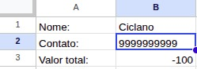
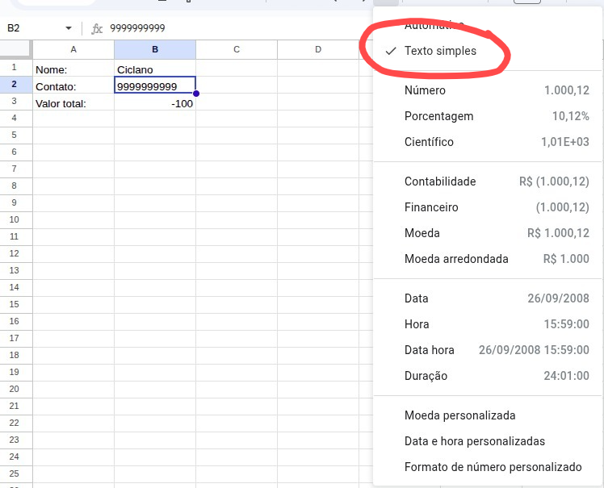

# Automação de Envio de mensagem(WhatsApp)

    Este projeto foi desenvolvido após observar a necessidade, em ambientes de trabalho, de enviar mensagens repetitivas — como cobranças, lembretes ou confirmações.
    A automação permite que mensagens personalizadas (porém via código) sejam enviadas automaticamente via WhatsApp Web, utilizando dados extraídos de uma planilha Excel.
                                                                                                                                            
## 🚀 Começando

    Atualmente, o projeto requer configuração manual e execução local do código.
    Em versões futuras, será disponibilizada uma forma mais acessível de instalação e execução.


## 📋 Pré-requisitos

    Antes de rodar o projeto, garanta que você tenha instalado:

### 🧰 Ferramentas
    - **Python 3.10+**
    - **Visual Studio Code** (ou qualquer outra IDE de sua preferência)
    - **Navegador Google Chrome**
    - **Arquivo .xlsxm, xl, planilha**

### 📦 Bibliotecas Python
    Instale as dependências com:

    ```bash
    pip install openpyxl selenium webdriver_manager customtkinter
    ```

    - Bibliotecas ja inclusas:
     `urllib` -> Manipula e codifica URLs, usado para gerar links do WhatsApp 
     `datetime` -> Trabalha com datas e horários, útil para logs e agendamentos 
      `tempfile` -> Cria arquivos temporários durante o processamento 
     `time` -> Controla pausas e intervalos entre os envios automáticos 

## ⚙️ Executando os testes

    🪜 Passo 1 — Configurar o arquivo Excel

    Salve sua planilha .xlsx na mesma pasta onde está o arquivo do programa .py.

    O programa espera que a planilha siga um padrão de colunas, conforme o exemplo abaixo:


### 🔍 Testes e Tratamento de Erros

    O sistema foi desenvolvido para lidar com situações comuns de erro e evitar falhas durante o envio.

    🧪 Testes realizados:

    - Verificação e formatação automática do número (+55)

    - Tratamento de entradas incorretas (ex: tipos de dados inválidos)

    - Retentativas de envio em caso de falha

    - Mensagens claras no terminal para cada etapa do processo

🔒 Exemplo de verificação:
# Ao pegar os números, é feita uma checagem automática:
        numero = cliente['Contato']
        if not numero.startswith('+'):
            numero = '+55' + numero

## 📦 Implantação

Aqui será listado o passo a passo de como implementar o código na utilização:

1. **Coleta de dados:**  
    Salvar e adaptar a planilha Excel (`.xlsx`), localizada na pasta do projeto.  
    Todos os dados (nome, número e mensagem) devem estar atualizados e no formato correto, lembrando que, o nome da pasta deve ser alterado caso faça uma personalização, o programa lê um nome especifico!

    Esse é um exeplo de como dever ser registrado os dados:
    
    **Atenção: Dados da primeiro coluna não são significantes, o programa pega apenas os dados B1, B2, B3**

    Aqui é como a célula do contato deve estar, necesário para que a biblioteca consiga mandar a mensagem!
    

    Logo após isso, é importante pensar em como as páginas são organizadas, no caso padrão, o programa lê em todas as páginas, porém com ajustes podemos ler um intervalo selecionado:
    
   

2. **Inicialização da automação:**
    Abre automaticamente o navegador **Google Chrome** utilizando o Selenium toda vez que rodar o código. Isso acontece para ser o processo     mais seguro, não conflitando com Chromes abertos, porém necessita de uma verificação toda rodagem.  
    No caso padrão, foi feito no Sistema Operacional Lixun Mint, então o caminho do Chrome pode ser um erro encontrado, com isso, quando for usar a aplicação, confira qual o caminho do seu Navegador. Segue o local que deve alterar:
    

   Em seguida, acessa o **WhatsApp Web** e aguarda o **escaneamento do QR Code** pelo usuário para liberar o acesso.

3. **Interface principal:**  
    Aqui o programa realmente começa, da forma que for utilizar, somente aqui o usuário realmente começa a usar, dependendo dasituação o código ficará intacto a ele.
    Onde o usuário pode visualizar e controlar as funções da automação de forma simples e rápida, sem ter que usar terminal ou linhas de código poluídas ou facíl jeito de quebra-las.
    
   

## 🛠️ Construído com

De maiores importancias, foram udados as seguintes ferramentas:

* [CustomTkinter](https://pypi.org/project/customtkinter/) - Biblioteca de Interface Grafica
* [Selenium](https://www.selenium.dev/) - Biblioteca para usar a Web, no caso WhatsApp Web
* [Openpyxl](https://openpyxl.readthedocs.io/en/stable/) - Biblioteca para leitura e manipulação de dados em arquivos xl


## ✒️ Autores

* **Felipe Silva** - *Automação de Mensageml* - [Felipe Silva](https://github.com/Felipe0132)

## 📄 Licença

Este projeto está sob a licença MIT — veja o arquivo LICENSE.md para mais detalhes.

## 🎁 Expressões de gratidão

* Com muita dor de cabeça, foi feito uma automação que creio ajudar muitas pessoas do ramo do financeiro. Por mais que seja algo simples e não muito trabalhoso, conseguir reduzir trabalhos repetitivos sempre merece um espaço no trabalho. Assim esse código ficará aberto e também fico a disposição para qualquer dúvida, alteração ou até mesmo implementação em seu dia-a-dia. Obrigado por testar!

